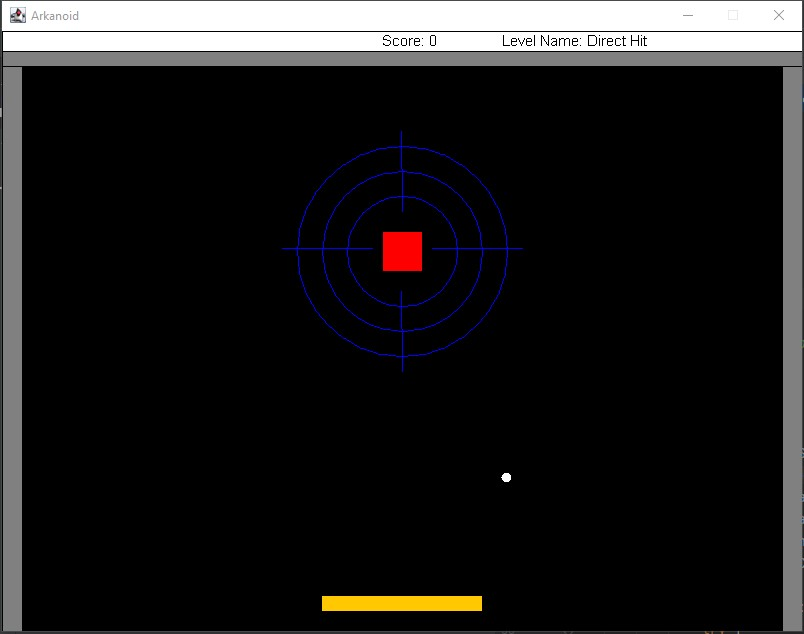
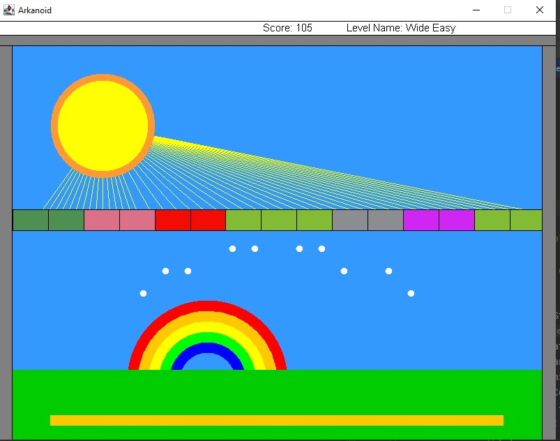
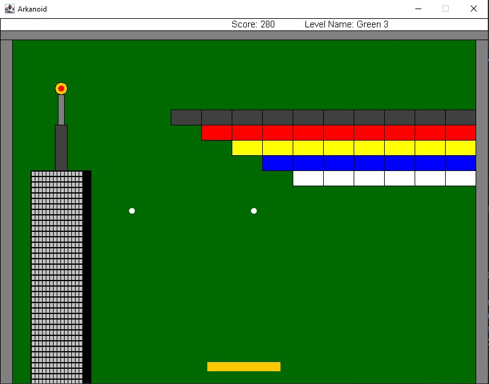
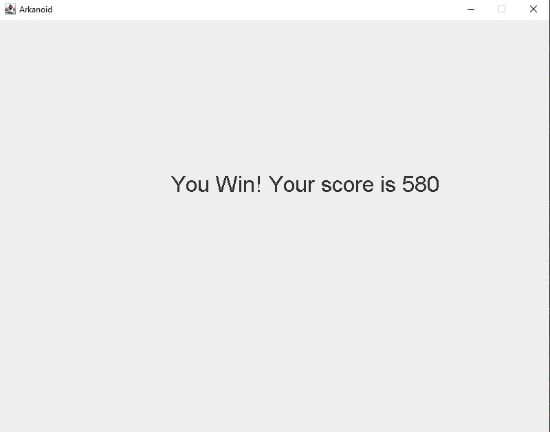

# Arkanoid Game

This is a classic Arkanoid-style game built in Java. The game includes multiple levels, score tracking, and end screens for "Game Over" and "You Win" scenarios. 

## Features

- **Multiple Levels**: Play through a series of levels, each with unique layouts and increasing difficulty.
- **Score Tracking**: Your score is tracked throughout the game and displayed at the end.
- **End Screens**: If you clear all levels, you'll see a "You Win" screen with your final score. If you lose, a "Game Over" screen will be shown.
- **Pause Functionality**: You can pause the game at any time by pressing the `p` key.

## Gameplay
### First level

### Second level

### Third level

### You Win screen

## Requirements

- Java Development Kit (JDK) 8 or higher

## How to Run

### Running the Game with Default Levels

To start the game with the default three levels, simply run the following command:

`java -jar ArkanoidGame.jar`

## Running the Game with Specific Levels
You can also specify which levels to play by providing the level numbers as arguments. For example:

`
java -jar ArkanoidGame.jar 1 3 2`
This command will run the game with levels 1, 3, and 2 in that order. The game will ignore any arguments that are not valid level numbers.

### Example Commands
Run the game with level 3 only:

`
java -jar ArkanoidGame.jar 3`
Run the game with levels 1, 2, 3:

`
java -jar ArkanoidGame.jar 1 2 3`

## Game Controls
* Left Arrow Key: Move the paddle to the left.
* Right Arrow Key: Move the paddle to the right.
* Space Key: Start the level or continue after a pause.
* P Key: Pause the game.
* Q Key: Quit the game.

## Code Structure
* Ass6Game: The main class that runs the game. Handles command line arguments and initializes levels.
* GameLevel: Handles the setup and running of individual levels.
* KeyPressStoppableAnimation: A decorator class that handles key press events to stop animations like pause, game over, and win screens.
